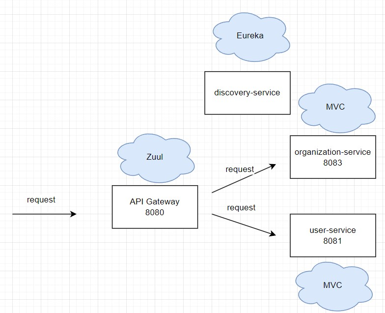

# Microservices Swagger Sample 
#### SpringCloud-Eureka-and-Zuul
在微服務的時代，在數個服務的前面往往會有一層gateway，使用者必須要透過gateway來存取後面的服務，這時候如果有使用swagger的需求，就必須讓gateway能夠取得各服務的api-doc資訊，必且在gateway的swagger做切換。

## Architecture
使用Zuul來做為Spring Cloud Netflix Zuul，服務發現則採用Spring Cloud Netflix Eureka Server，假設使用者不能直接連線到organization or user service。

版本要使用 Java 1.8

詳細介紹請看我的[文章](https://believe67.medium.com/microservices-sample-with-swagger-ui-65996ed78fdc)

